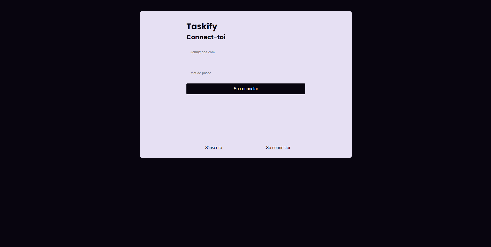

# Taskify V1

Taskify est une application de liste de tâches simple et intuitive. Créez des tâches, fixez des dates d'échéance et cochez-les une fois terminées. Restez organisé et productif, où que vous soyez, grâce à Taskify.

## Fonctionnalités principales :

- **Création de tâches :** Ajoutez facilement des tâches à accomplir.
- **Marquage des tâches terminées :** Cochez les tâches une fois qu'elles sont accomplies pour garder une trace de votre progression.
- **Interface intuitive :** Une conception simple et conviviale pour une expérience utilisateur agréable.
- **Accessibilité multiplateforme :** Utilisez Taskify sur tous vos appareils, que ce soit sur ordinateur, tablette ou smartphone.

## Technologies utilisées :

- **React :** Une bibliothèque JavaScript pour la construction d'interfaces utilisateur.
- **Node.js :** Une plateforme JavaScript côté serveur pour créer des applications web évolutives.
- **Express :** Un framework web pour Node.js pour simplifier la création d'API et de serveurs.
- **PostgreSQL :** Un système de gestion de base de données relationnelle puissant et open source.

## Comment utiliser Taskify :

1. **Créez un compte :** Si c'est votre première fois, créez un compte Taskify pour commencer.
2. **Ajoutez des tâches :** Cliquez sur le bouton "Ajouter une tâche" et saisissez les détails de votre tâche.
3. **Marquez vos tâches terminées :** Une fois une tâche accomplie, cochez-la pour la déplacer hors de votre liste active.
4. **Restez organisé et productif :** Utilisez Taskify pour suivre vos tâches et rester concentré sur vos objectifs.

## Captures d'écran :

## Contact :

Pour toute question ou suggestion, n'hésitez pas à nous contacter à [agboton.dev@proton.me](mailto:agboton.dev@proton.me) ou à ouvrir une issue dans ce référentiel.
